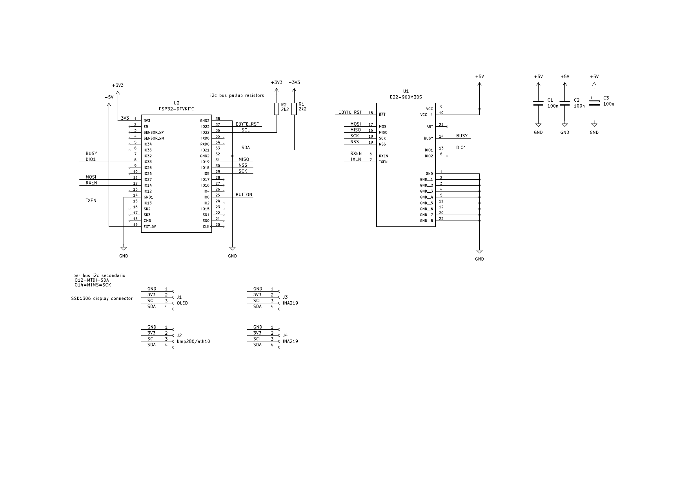
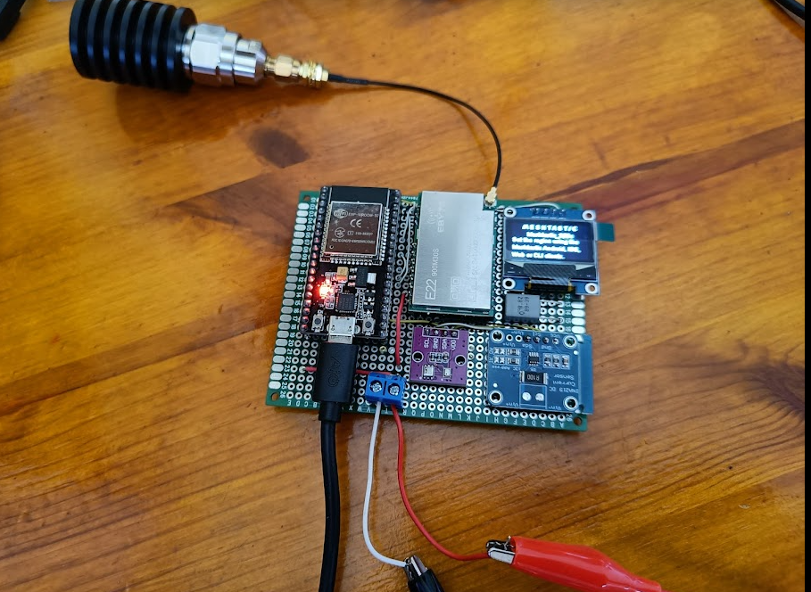
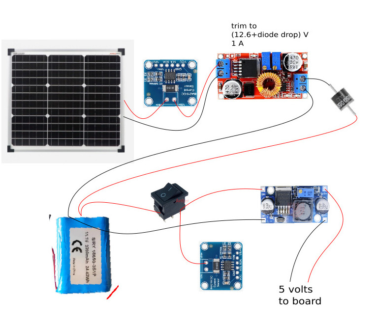

# meshtastic dev board
Dev board using hardware modules and cards found in online shops

[Firmware](https://github.com/fzellini/meshtastic-firmware/tree/iqdata) is a fork of official meshtastic firmware, i added a new project environment "iqdata".

Relevant files are in [/variants/diy/iqdata/ ](https://github.com/fzellini/meshtastic-firmware/tree/iqdata/variants/diy/iqdata)

# Kicad meshtastic dev board schematic diagram

# meshtastic dev board first prototype

# pwr supply with solar panel

