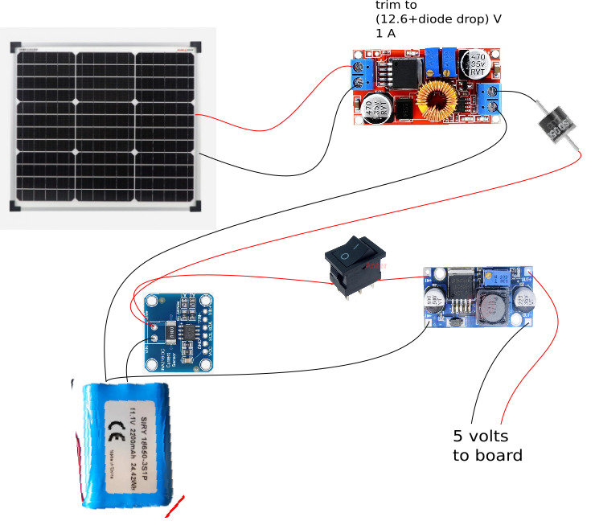

# meshtastic dev board
Dev board using hardware modules and cards found in online shops

Use [hydra](https://github.com/meshtastic/firmware/tree/master/variants/diy/hydra) variants

# Kicad meshtastic dev board schematic diagram

# meshtastic dev board first prototype

# pwr supply with solar panel

